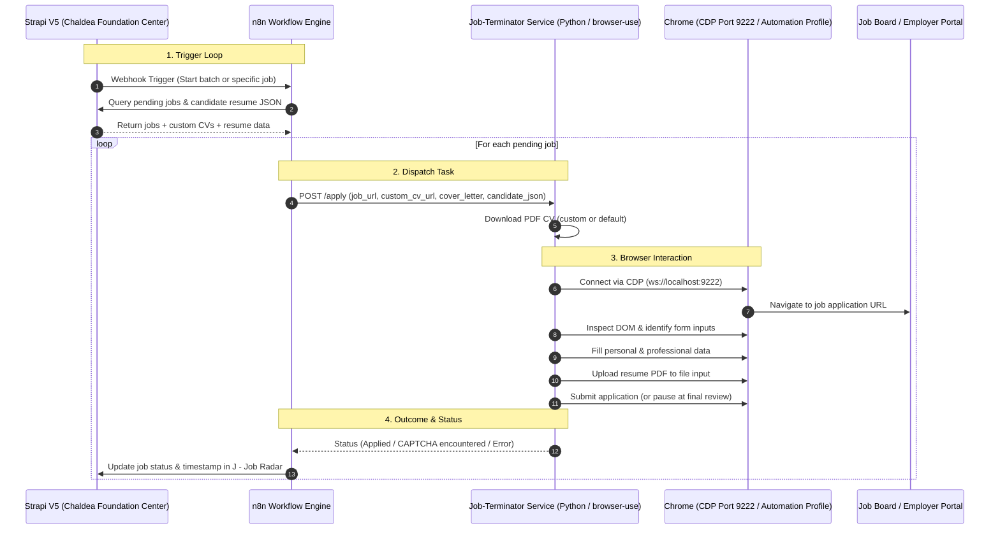

# Job Terminator 🤖💼

> Autonomous Job Application Agent orchestrated via **n8n**, powered by **browser-use**, integrated with **Strapi V5**, and driven by your authenticated Chrome session.

---

## 📌 Overview

**Job Terminator** is an end-to-end autonomous job application system designed to:
1. **Receive Webhook Trigger from Strapi / n8n**: Listen for a single trigger event that initiates the batch or loop application process.
2. **Fetch Job Offers & Custom Documents from Strapi V5**: Pull pending jobs from `J - Job Radar` (`j-job-radar`), checking for job-specific `custom_cv` or `cover_letter`.
3. **Fallback to Default Resume**: Use the latest profile information from Strapi's `updated-resume` endpoint (`/api/updated-resume?populate=*`) and default resume PDF if custom documents are absent.
4. **Take Over Authenticated Browser via CDP (Port 9222)**: Use `browser-use` attached to an existing Chrome instance retaining active logins (LinkedIn, Glassdoor, Greenhouse, Lever, Workday, etc.).
5. **Autonomously Fill Forms & Upload Resumes**: Navigate form fields, dynamically map JSON applicant data to input fields, upload PDFs, and apply.
6. **Report Back Status to Strapi / n8n**: Update application status, timestamps, and execution logs.

---

## 🏗️ Architecture & Component Flow



---

## 🔍 Critical Research & Technical Constraints

During technical investigation, the following key findings and constraints were identified:

### 1. Chrome Remote Debugging & Profile Restrictions (Chrome 136+)
- Starting in Chrome 136, Google blocks `--remote-debugging-port` on the default Chrome profile path to protect sensitive credentials from remote extractors.
- **Solution**: Run a dedicated automation user profile directory (e.g. `--user-data-dir="C:\Users\gonza\ChromeProfile_Automation"`). You log into LinkedIn, Indeed, etc. **once** in this window; all cookies and sessions remain permanently saved there for automation.
- Launch command:
  ```powershell
  & "C:\Program Files\Google\Chrome\Application\chrome.exe" --remote-debugging-port=9222 --user-data-dir="$HOME\.chrome-job-terminator"
  ```

### 2. Resume & Document Ingestion
- Strapi V5 hosts candidate JSON at:
  `https://admin.chaldea.foundation/api/updated-resume?populate=*`
- Default Resume PDF at:
  `https://admin.chaldea.foundation/uploads/gonzalo_salvador_corvalan_Resume_fe85477412.pdf`
- When a job has `custom_cv` or `cover_letter` attached in `j-job-radar`, those take precedence.
- `browser-use` requires local file paths passed to `available_file_paths=["/path/to/downloaded_cv.pdf"]` for file upload inputs.

### 3. n8n Container vs Host Network
- `n8n` runs in Docker Compose (`ports: 5678:5678`).
- The Python agent running locally on Windows will listen on an HTTP port (e.g., `8000`).
- To communicate from the Docker container to the Windows host, `host.docker.internal:8000` is used.

### 4. Anti-Bot, CAPTCHAs, and Autonomy
- While CDP reuse prevents most bot detection triggers, job portals occasionally present Cloudflare Turnstile or reCAPTCHA.
- We must determine whether the system runs **100% autonomous** (clicking Submit directly) or in **semi-autonomous mode** (pausing at the final submit screen or alerting when CAPTCHA is detected).
